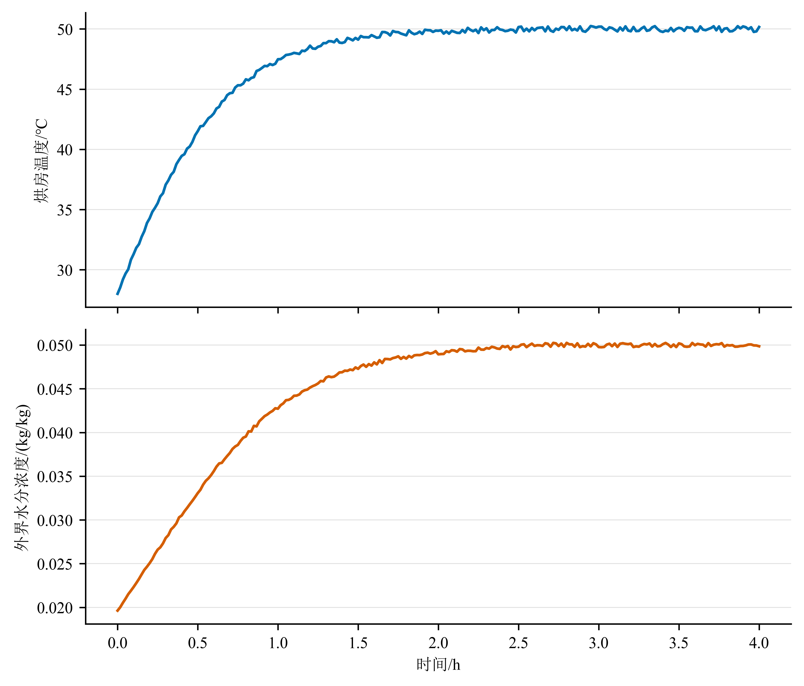
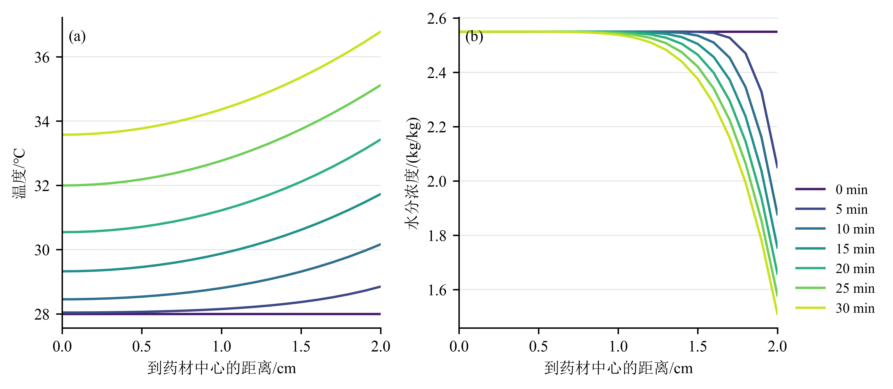
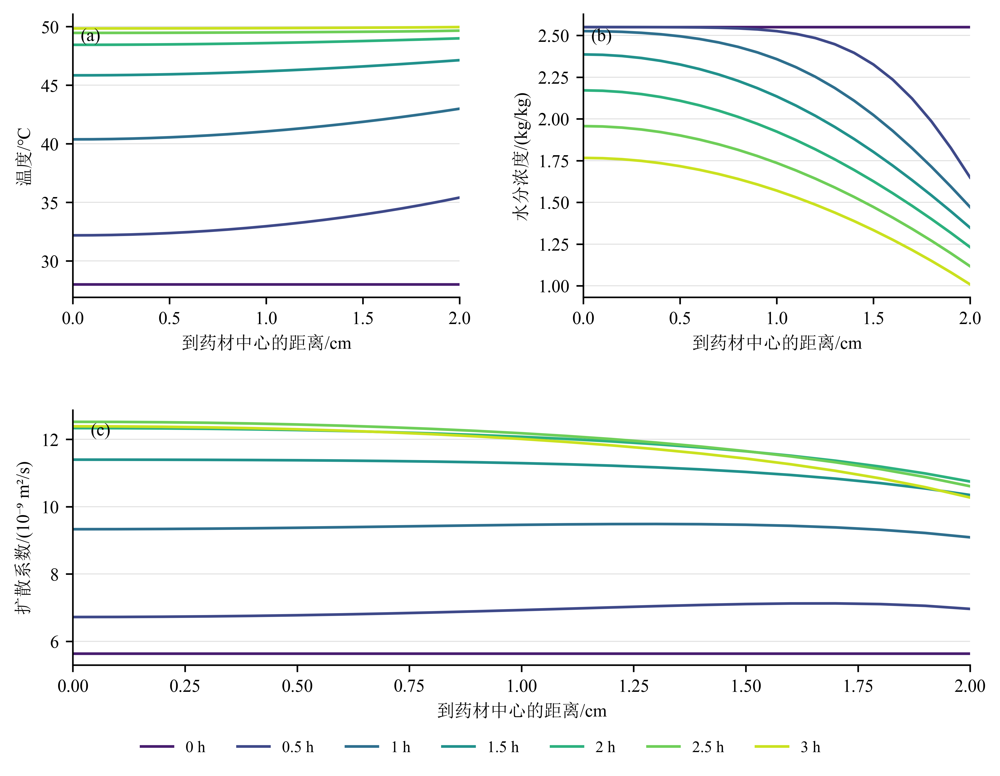

# A题药材烘干问题：综合优化最终建模报告

> 文档定位：模型与代码实现冻结稿。本文综合《方案二模型详解（1B-2B-3B-4B）》与《A题_方案二_最终复核报告》，并以原题、附件1、附件2和附件3中的四个结果模板为最终口径。问题一和问题二已完成正式计算、网格收敛与独立时间积分复核，正文表1至表4及图1至图3均由同一未舍入结果对象生成；问题三和问题四仍按本文路线继续实现。

## 1. 最终路线与取舍结论

四问统一采用“物理模型一条主线、数值算法一套内核、独立方法负责验证”的结构：

\[
\boxed{
\text{圆柱热湿传递方程}
\rightarrow \text{守恒有限体积空间离散}
\rightarrow \text{MOL--BDF自适应时间积分}
\rightarrow \text{全域终点事件}
\rightarrow \text{材料坐标收缩模型}
}
\]

各问不把多个模型的结果简单平均，而是按“主模型解决题目、辅助模型验证主模型、对照模型解释改进”的方式综合优点：

| 问题 | 正式主模型 | 吸收的其他方法优点 | 不采用的方案及原因 |
|---|---|---|---|
| Q1 | 一维圆柱有限体积法 FVM + 方法线 MOL + BDF | 用CN--Picard作独立时间离散复核；用恒系数Bessel级数解核验圆柱中心和Robin边界 | 集总参数法不能描述径向梯度；显式差分受稳定步长限制，仅可作小规模调试 |
| Q2 | 变物性、双向系数耦合的FVM--BDF | 调和平均刻画界面串联阻力；CN--Picard或Radau对关键时刻做独立复核 | 不增加无题给参数的蒸发潜热或吸附热，避免“强耦合”名义下引入不可验证参数 |
| Q3 | Q2同一PDE解 + 全域最大值判定 + Brent精确定位 | 60 s扫描保证与模板对齐；单调性检查解释中心是否为控制点；确定性灵敏度分析评估稳健性 | 不用平均含水率或仅中心值预设终点；不以Page经验式替代PDE终点 |
| Q4 | 材料坐标固定域FVM--BDF + PCHIP半径插值 | 三算例分解物性变化与几何收缩；线性插值作为数据处理对照 | 不采用与材料守恒起点冲突的额外 \(R'(t)\) 对流项；不使用高阶全局多项式外推半径 |

这些方法并未“淘汰”。有限体积、BDF、Radau、PCHIP和Brent仍是守恒型PDE、刚性常微分方程、保形插值和一维求根中的通用方法。方法是否适合本题，应由题意、数据和验证决定，而不是由提出年代决定。

## 2. 题目逻辑链与四问关系

### 2.1 四问的递进关系

1. Q1在固定半径和附录2物性下建立、验证统一的圆柱热湿传递计算内核。
2. Q2从题给初始状态重新开始，整段过程采用附录3变物性公式；不能从Q1的1800 s终态续算。
3. Q3延长Q2的同一附录3仿真，寻找全域含水率首次严格低于0.15 kg/kg的时刻；不重复建立另一套干燥模型。
4. Q4再次从题给初始状态开始，改用附录4物性和附件2的时变半径；不能从Q3终态续算。

因此，Q1负责“搭求解器并验证”，Q2负责“加入真实变物性耦合”，Q3负责“把状态仿真转为终点决策”，Q4负责“加入收缩并区分几何与物性作用”。

### 2.2 模型精度的边界

本题没有提供药材内部温度或含水率的实验观测值，因此可以严格评价的是数值误差、守恒误差和情景稳健性，不能仅凭四位小数输出声称真实预测误差达到 \(10^{-4}\)。最终报告应分别说明：

- 数值精度：网格、时间容差、算法复核和守恒残差；
- 参数稳健性：\(D\)、\(h_m\)、长期烘房边界和收缩幅度变化对结论的影响；
- 模型局限：一维假设、附件水分字段的边界解释、4 h后边界延续。

## 3. 原题与附件数据对齐

### 3.1 数据审查结果

| 数据文件 | 有效记录 | 时间范围与间隔 | 关键范围 | 处理方式 |
|---|---:|---|---|---|
| 附件1 | 241行 | 0–14400 s，每60 s | 温度28.000–50.246 ℃；水分浓度0.01963–0.05025 kg/kg | 保留原始波动，区间内分段线性插值 |
| 附件2 | 145行 | 0–259200 s，每1800 s | 半径2.000–1.198 cm，数据非增；241200 s后保持1.198 cm | 主方案用PCHIP保形插值，线性插值作对照 |
| result1模板 | 2个工作表 | 题目要求1–1800 s，每1 s | 0–2 cm，每0.1 cm | 展开为1800行、21个空间位置 |
| result2模板 | 2个工作表 | 题目要求1–10800 s，每1 s | 0–2 cm，每0.1 cm | 展开为10800行、21个空间位置 |
| result3模板 | 1个工作表 | 从60 s起，每60 s | 0–2 cm，每0.1 cm | 保存到首个严格达标的60 s时刻 |
| result4模板 | 1个工作表 | 从60 s起，每60 s | 固定物理距离0、0.1、… cm及“药材表面” | 超过实时半径的位置留空 |

附件1温度和水分浓度均存在小幅上下波动，不能为了视觉平滑强制单调化。最后1 h均值约为49.999 ℃和0.049988 kg/kg，支持将4 h后的主情景设为50 ℃和0.05 kg/kg；同时必须用“保持附件最后值”作为边界延续对照。两者都属于情景假设，不是4 h后的实测数据。

### 3.2 数据到模型的唯一映射

| 原题/附件量 | 代码变量 | 内部单位 | 用途 |
|---|---|---|---|
| 时间 | `time_s` | s | 边界插值、求解与输出 |
| 烘房温度 | `T_air(t)` | ℃ | 热Robin边界；代入扩散系数前加273.15 |
| 烘房水分浓度 | `b_air(t)` | kg/kg | 作为有效外界含水势进入水分Robin边界 |
| 药材半径 | `R(t)` | m | Q1–Q3固定0.02 m；Q4来自附件2并由cm转m |
| 药材温度 | `T(r,t)` | ℃ | 状态变量 |
| 干基含水率 | `C(r,t)` | kg/kg | 状态变量及终点判据 |

附件1的“水分浓度”数值约为0.02–0.05，而药材初始干基含水率为2.55。题目未给空气湿度比到材料平衡含水率的吸附等温线，因此主模型把附件字段解释为题设给定的“有效外界含水势” \(b(t)\)。论文必须明确这是一项闭合假设，不能写成两者在物理上天然同一概念。

## 4. 统一物理模型

### 4.1 基本假设

1. 药材为轴对称圆柱，内部状态主要随半径变化；Q1–Q3半径固定，Q4径向同比例收缩且长度保持0.25 m。
2. 初始温度和含水率在内部均匀，分别为28 ℃和2.55 kg/kg。
3. 药材内部没有体积热源和水分源；表面通过对流换热、对流传质与烘房交换。
4. Q1–Q3忽略端面通量。端面面积与侧面积之比为 \(R/L=0.08\)，轴向半长度与径向尺度的扩散时间比约为 \((L/2R)^2=39.06\)，可作为一维径向模型的尺度依据，但不是严格误差证明。
5. 附录3、4未重新给出 \(h_T,h_m\)，故沿用附录2的 \(h_T=25\ \mathrm{W/(m^2\cdot K)}\)、\(h_m=8\times10^{-7}\ \mathrm{m/s}\)，并将其列为题意继承假设。
6. 不自行加入蒸发潜热、吸附热、孔隙率或收缩力学参数；这些参数没有附件依据，加入后反而降低可验证性。

### 4.2 控制方程

固定半径阶段的温度和水分方程为

\[
\rho(C)c_p(C)\frac{\partial T}{\partial t}
=\frac{1}{r}\frac{\partial}{\partial r}
\left(rk(C)\frac{\partial T}{\partial r}\right),
\tag{1}
\]

\[
\frac{\partial C}{\partial t}
=\frac{1}{r}\frac{\partial}{\partial r}
\left(rD(C,T_K)\frac{\partial C}{\partial r}\right),
\qquad T_K=T+273.15.
\tag{2}
\]

初始条件为

\[
T(r,0)=28\ ^\circ\mathrm C,\qquad C(r,0)=2.55\ \mathrm{kg/kg}.
\tag{3}
\]

中心对称边界为

\[
T_r(0,t)=0,\qquad C_r(0,t)=0.
\tag{4}
\]

表面Robin边界为

\[
-kT_r(R,t)=h_T[T_s-T_\infty(t)],
\tag{5}
\]

\[
-DC_r(R,t)=h_m[C_s-b(t)].
\tag{6}
\]

方程中的 \(k,D\) 位于散度算子内部。变系数情况下不能将式(1)、(2)简化为 \(k\nabla^2T\) 或 \(D\nabla^2C\)。

### 4.3 分布参数模型的必要性

按Q1初始参数估算

\[
\alpha=\frac{k}{\rho c_p}\approx1.69\times10^{-7}\ \mathrm{m^2/s},
\]

\[
Bi_{T,R}=\frac{h_TR}{k}\approx1.389,
\qquad
Bi_{m,R}=\frac{h_mR}{D(C_0)}\approx3.24.
\]

即使采用侧面积特征长度 \(V/A=R/2\)，热Biot数仍约为0.694，不能把药材视为内部处处均匀。因此集总参数法只可作为数量级基线，不可作为正式结果模型。

## 5. 统一数值内核：守恒FVM--MOL--BDF

### 5.1 空间离散

将半径方向划分为同心圆柱控制体。节点 \(r_i\) 对应控制体边界 \(r_{i-1/2},r_{i+1/2}\)，其体积和界面面积为

\[
V_i=\pi L(r_{i+1/2}^2-r_{i-1/2}^2),
\qquad
A_{i+1/2}=2\pi Lr_{i+1/2}.
\tag{7}
\]

定义向半径增大方向为正的水分通量

\[
J_{i+1/2}=-D_{i+1/2}
\frac{C_{i+1}-C_i}{r_{i+1}-r_i}.
\tag{8}
\]

控制体水分平衡为

\[
V_i\frac{dC_i}{dt}
=A_{i-1/2}J_{i-1/2}-A_{i+1/2}J_{i+1/2}.
\tag{9}
\]

热量平衡为

\[
\rho_i c_{p,i}V_i\frac{dT_i}{dt}
=A_{i-1/2}q_{i-1/2}-A_{i+1/2}q_{i+1/2},
\tag{10}
\]

其中

\[
q_{i+1/2}=-k_{i+1/2}
\frac{T_{i+1}-T_i}{r_{i+1}-r_i}.
\tag{11}
\]

同一内部界面通量只计算一次，并以相反符号进入相邻两个控制体。总体求和时内部通量严格相消，这是守恒性的来源。中心界面面积为0，无需在 \(r=0\) 直接计算 \(1/r\)。最外侧通量直接由式(5)、(6)给出。

对等距节点，界面系数采用调和平均

\[
D_{i+1/2}=\frac{2D_iD_{i+1}}{D_i+D_{i+1}},
\qquad
k_{i+1/2}=\frac{2k_ik_{i+1}}{k_i+k_{i+1}}.
\tag{12}
\]

若表层低扩散区域导致均匀网格收敛缓慢，再启用靠近表面的保序加密网格；不在尚未检查网格误差时预设复杂网格。

### 5.2 时间积分

空间离散后形成

\[
\frac{d\mathbf y}{dt}=\mathbf F(t,\mathbf y),
\qquad
\mathbf y=(T_0,\ldots,T_N,C_0,\ldots,C_N)^\mathsf T.
\tag{13}
\]

主求解器采用BDF自适应隐式积分。每次计算 \(\mathbf F\) 时，根据当前节点的 \(T_i,C_i\) 重新计算物性和界面通量。初始试算参数为：

- `rtol = 1e-7`；
- 温度分量 `atol_T = 1e-7`；
- 含水率分量 `atol_C = 1e-9`；
- `max_step = 60 s`，在输入快速变化段可缩小到10–30 s；
- 使用连续输出在题目指定时刻采样。

这些数值只是起始设置。正式参数由网格与容差收敛结果确定。BDF稳定不等于结果必然非负、无振荡或足够准确；若出现负含水率，不直接截断为0，而应检查边界符号、网格、容差和最大步长。

### 5.3 CN--Picard的角色

CN--Picard保留为独立复核器，不作为全题唯一内核。它具有离散过程直观、三对角系统可用Thomas算法快速求解的优点，适合在Q1和Q2若干关键时刻与BDF结果比较。复核时应比较全场最大差、中心差和表面差，不能只比较四位小数，也不能把“线性问题无条件稳定”误写成“任意大步长都准确”。

## 6. 问题一：预热阶段固定物性热传递与非线性水分扩散

### 6.1 物性

Q1采用附录2：

\[
\rho=820\ \mathrm{kg/m^3},\quad
c_p=2600\ \mathrm{J/(kg\cdot K)},\quad
k=0.36\ \mathrm{W/(m\cdot K)},
\tag{14}
\]

\[
D_1(C)=7\times10^{-9}\exp(-0.89/C)\ \mathrm{m^2/s}.
\tag{15}
\]

温度方程为线性变边界问题；水分方程仍因 \(D_1(C)\) 非线性。Q1不应被称为完全常系数模型，也不存在明显的温度到水分反馈。

### 6.2 求解与输出

从式(3)出发求解0–1800 s，在100、300、600、900、1200、1500、1800 s提取 \(r=0,0.5,1,1.5,2\) cm处的温度和含水率，形成正文表1、表2；在1–1800 s逐秒、0–2 cm每0.1 cm采样并写入`result1.xlsx`。

内部计算网格不受输出0.1 cm限制。依次计算40、80、160、320个径向区间，并选用320区间网格作为正式结果；输出位置从未舍入的连续/离散场一次性提取。

表1给出30 min内药材温度。数值保留四位小数，完整逐秒结果见`result1.xlsx`。

| 时间/s | 0 cm | 0.5 cm | 1 cm | 1.5 cm | 2 cm |
|---:|---:|---:|---:|---:|---:|
| 100 | 28.0001 | 28.0003 | 28.0040 | 28.0327 | 28.1801 |
| 300 | 28.0408 | 28.0635 | 28.1514 | 28.3681 | 28.8488 |
| 600 | 28.4533 | 28.5360 | 28.8039 | 29.3159 | 30.1654 |
| 900 | 29.3243 | 29.4583 | 29.8755 | 30.6162 | 31.7305 |
| 1200 | 30.5427 | 30.7098 | 31.2224 | 32.1126 | 33.4276 |
| 1500 | 31.9957 | 32.1868 | 32.7660 | 33.7463 | 35.1203 |
| 1800 | 33.5754 | 33.7720 | 34.3642 | 35.3621 | 36.7856 |

表2给出30 min内药材水分浓度，单位为kg/kg。

| 时间/s | 0 cm | 0.5 cm | 1 cm | 1.5 cm | 2 cm |
|---:|---:|---:|---:|---:|---:|
| 100 | 2.5500 | 2.5500 | 2.5500 | 2.5500 | 2.2472 |
| 300 | 2.5500 | 2.5500 | 2.5500 | 2.5492 | 2.0509 |
| 600 | 2.5500 | 2.5500 | 2.5500 | 2.5353 | 1.8770 |
| 900 | 2.5500 | 2.5500 | 2.5497 | 2.5045 | 1.7547 |
| 1200 | 2.5500 | 2.5500 | 2.5482 | 2.4646 | 1.6586 |
| 1500 | 2.5500 | 2.5499 | 2.5445 | 2.4206 | 1.5787 |
| 1800 | 2.5500 | 2.5497 | 2.5383 | 2.3755 | 1.5102 |

附件1的边界温湿度先快速上升，约2.5 h后在50 ℃和0.05 kg/kg附近波动，如图1所示。Q1的径向剖面见图2：温度扰动由表面向中心传播，水分则优先从表层迁移，30 min时中心含水率仍接近初值，而表面已降至1.5102 kg/kg。





### 6.3 综合验证

1. 将 \(D\) 固定、边界固定，与圆柱第三类边界的Bessel级数解比较。
2. 对正式变 \(D(C)\) 模型做40/80/160/320网格收敛。
3. 用CN--Picard小步长结果复核BDF在7个正文时刻的中心、表面和剖面。
4. 检查温度和含水率值域、边界通量方向和总体水分平衡。

Q1的作用不是堆砌算法，而是证明后续三问复用的空间离散和边界实现正确。

当前实现完成了网格收敛、CN--Picard复核、均匀场零导数和总体水分守恒检查。160到320区间网格的指定点最大差为0.00009 ℃和0.000349 kg/kg；BDF与CN--Picard最大差为0.000111 ℃和约1×10^-6 kg/kg；累计水分平衡相对残差为1.51×10^-6。上述指标均低于本文第10.3节的初始验收阈值。圆柱Bessel级数解析基准尚未加入代码，不将其列为已完成验证。

## 7. 问题二：变物性热湿双向系数耦合

### 7.1 物性与耦合关系

Q2从 \(t=0\) 重新计算，采用附录3：

\[
\rho_3(C)=650+128C,
\tag{16}
\]

\[
c_{p,3}(C)=1450+2736\frac{C}{C+1},
\qquad
k_3(C)=0.21+0.38\frac{C}{C+1},
\tag{17}
\]

\[
D_3(C,T_K)=2.4\times10^{-3}
\exp(-0.45/C)\exp(-3850/T_K).
\tag{18}
\]

式(18)中的温度必须使用K。模型存在两条反馈：

\[
C\rightarrow(\rho,c_p,k)\rightarrow T,
\qquad
(T,C)\rightarrow D\rightarrow C.
\tag{19}
\]

因此可称为“变物性热湿双向系数耦合”，但不能称为包含潜热和吸附热的完整热力学强耦合。

### 7.2 求解与输出

在每次BDF状态导数计算中按节点更新式(16)–(18)，再通过式(8)–(12)形成共享界面通量。求解0–10800 s，在0.5、1.0、1.5、2.0、2.5、3.0 h提取5个指定位置形成正文表3、表4；在1–10800 s逐秒写入`result2.xlsx`。

Q2与Q3共用一次长时间附录3仿真：Q2只是截取最初3 h，避免重复运行产生不一致结果。

表3给出3 h内药材温度，单位为℃。

| 时间/h | 0 cm | 0.5 cm | 1 cm | 1.5 cm | 2 cm |
|---:|---:|---:|---:|---:|---:|
| 0.5 | 32.1893 | 32.3821 | 32.9659 | 33.9608 | 35.4130 |
| 1.0 | 40.3816 | 40.5536 | 41.0605 | 41.8783 | 42.9976 |
| 1.5 | 45.8468 | 45.9348 | 46.1930 | 46.6051 | 47.1402 |
| 2.0 | 48.4502 | 48.4881 | 48.5984 | 48.7735 | 49.0033 |
| 2.5 | 49.4670 | 49.4792 | 49.5137 | 49.5654 | 49.6609 |
| 3.0 | 49.8495 | 49.8554 | 49.8746 | 49.9102 | 49.9664 |

表4给出3 h内药材水分浓度，单位为kg/kg。

| 时间/h | 0 cm | 0.5 cm | 1 cm | 1.5 cm | 2 cm |
|---:|---:|---:|---:|---:|---:|
| 0.5 | 2.5499 | 2.5489 | 2.5256 | 2.3257 | 1.6486 |
| 1.0 | 2.5257 | 2.4948 | 2.3578 | 2.0230 | 1.4711 |
| 1.5 | 2.3861 | 2.3256 | 2.1344 | 1.8020 | 1.3476 |
| 2.0 | 2.1709 | 2.1084 | 1.9236 | 1.6259 | 1.2311 |
| 2.5 | 1.9566 | 1.9006 | 1.7360 | 1.4720 | 1.1166 |
| 3.0 | 1.7662 | 1.7165 | 1.5702 | 1.3333 | 1.0081 |

药材温度在3 h内逐渐接近烘房温度，中心和表面分别达到49.8495 ℃和49.9664 ℃。水分迁移明显慢于传热，3 h时中心含水率仍为1.7662 kg/kg，表面降至1.0081 kg/kg，径向差为0.7581 kg/kg。因此，后续问题三必须继续使用分布参数模型按全域最大含水率判定终点，不能用表面值或体积平均值提前停止。

图3同时给出温度、水分浓度和扩散系数的径向演化。温度场在2.5 h后已接近均匀，而水分场仍保持明显的中心至表面梯度。扩散系数由式(18)中的温度项和含水率依赖项共同决定：升温使其整体增大，表层快速失水又削弱该增幅。3 h时中心和表面的扩散系数分别为 $1.239\times10^{-8}$ 和 $1.027\times10^{-8}\ \mathrm{m^2/s}$，空间差异仍然明显。这种系数反馈说明问题二不能把扩散系数固定为初始值。



### 7.3 准确性补强

- 用BDF作为主解，Radau或CN--Picard在0–3 h对照关键剖面；
- 监控 \(D_3\) 的数量级和空间最小值，重点检查低含水率表层；
- 对 \(T_K=T+273.15\) 设置专门量纲断言；
- 对比80/160/320网格并用Radau复核时间积分，检查四位小数中哪些位稳定；
- 不能为了加速而人为设置未说明的 \(D\) 下限。

实际校验结果如下。

| 校验项目 | 温度 | 水分浓度 | 结论 |
|---|---:|---:|---|
| 80到160区间网格最大差 | 0.000112 ℃ | 0.0000468 kg/kg | 通过阈值 |
| 160到320区间网格最大差 | 0.000127 ℃ | 0.0000116 kg/kg | 通过阈值 |
| BDF与Radau最大差 | 0.000162 ℃ | 1.28×10^-7 kg/kg | 通过 |
| 均匀场导数最大值 | 0 | 0 | 通过 |

温度网格差在两级加密间均约为1×10^-4 ℃，但没有单调递减，因此不据此报告观察阶或Richardson外推值；两级差值均远低于0.02 ℃验收阈值。含水率网格差随加密约缩小至四分之一。计算过程中扩散系数位于5.55×10^-9至1.25×10^-8 m²/s，密度、比热、导热系数和扩散系数始终为正。含水率剖面保持由中心向表面不增。约2.92 h时，表面附近温度因附件1的实测边界波动出现约2.96×10^-4 ℃的局部反向梯度；该幅度与外界温度短时波动一致，因此保留原始边界响应，不对温度剖面强制单调化。

## 8. 问题三：全域终点判定与稳健性分析

### 8.1 长期边界

0–14400 s严格读取附件1并线性插值。4 h后主情景取附件末段平台均值的简化值

\[
T_\infty=50\ ^\circ\mathrm C,\qquad b=0.05\ \mathrm{kg/kg}.
\tag{20}
\]

边界对照情景保持附件最后值 \((50.165\ ^\circ\mathrm C,0.04986\ \mathrm{kg/kg})\)。若两情景终点差异不可忽略，应将差异作为结论范围报告，而不是只给单一精确时刻。

### 8.2 全域终点事件

定义

\[
C_{\max}(t)=\max_{0\le r\le R}C(r,t),
\qquad
g(t)=C_{\max}(t)-0.15.
\tag{21}
\]

正式终点为

\[
t_*:=\inf\{t\ge0:C_{\max}(t)<0.15\}.
\tag{22}
\]

程序先在60 s输出序列上寻找 \(g(t_a)\ge0\)、\(g(t_b)<0\) 的首个区间，再利用同一连续数值解通过Brent法求解 \(g(t_*)=0\)。同时保存：

- 根区间 \([t_a,t_b]\)；
- 根两侧的 \(C_{\max}\)；
- 最大值所在位置 \(r_{\max}(t)\)；
- 首个严格达标的60 s输出时刻。

只有数值剖面持续满足径向含水率向外不增、且终点附近最大值确实位于中心，才能将式(21)简化解释为中心控制。算法仍应始终按全域最大值判定，避免先验假定失效。

### 8.3 输出

正文表5在6、12、18 h等每6 h及烘干结束时间给出5个指定位置的水分浓度。`result3.xlsx`从60 s开始每60 s保存0–2 cm每0.1 cm的完整结果，保存至首个严格达标的60 s时刻。非60 s的精确根单独写入CSV/TXT和正文表，不擅自破坏模板的固定时间间隔。

### 8.4 灵敏度分析

优先研究对终点 \(t_*\) 有明确物理作用、且代码中可独立控制的参数：

\[
D'=s_DD,\qquad h_m'=s_hh_m.
\tag{23}
\]

对无文献误差范围的参数，采用 \(\eta=5\%\) 或10%的确定性扰动，计算无量纲局部弹性

\[
S_p=\frac{t_*[p_0(1+\eta)]-t_*[p_0(1-\eta)]}
{2\eta t_*(p_0)}.
\tag{24}
\]

式(24)表示模型对参数扰动的响应，不代表参数真实服从该误差分布。Q3至少完成：

1. \(s_D=0.9,1.0,1.1\)；
2. \(s_h=0.9,1.0,1.1\)；
3. 式(20)与附件最后值保持两种长期边界；
4. 若单因素结果显示 \(D\) 与 \(h_m\) 均重要，再做3×3二维组合，检查交互。

若后续文献提供可信参数区间，再使用Latin hypercube抽样和PRCC/Sobol作全局灵敏度；在没有参数分布依据时不进行大规模随机模拟，也不报告虚构的95%置信区间。

## 9. 问题四：材料坐标下的收缩域模型

### 9.1 材料坐标与守恒推导

设径向同比例收缩，定义材料坐标

\[
\xi=\frac{r}{R(t)}=\frac{r_0}{R_0}\in[0,1],
\qquad
v(r,t)=\frac{R'(t)}{R(t)}r.
\tag{25}
\]

令 \(\rho_d\) 为单位当前体积的干固体质量，假设干固体不流失。干固体和水分连续方程为

\[
\frac{\partial\rho_d}{\partial t}
+\frac1r\frac{\partial}{\partial r}(r\rho_dv)=0,
\tag{26}
\]

\[
\frac{\partial(\rho_dC)}{\partial t}
+\frac1r\frac{\partial}{\partial r}
\left[r(\rho_dCv+j)\right]=0,
\quad
j=-\rho_dD\frac{\partial C}{\partial r}.
\tag{27}
\]

由式(26)、(27)得到

\[
\rho_d\left(C_t+vC_r\right)
=\frac1r\frac{\partial}{\partial r}
\left(r\rho_dDC_r\right).
\tag{28}
\]

令 \(U(\xi,t)=C(r,t)\)。在均匀同比例收缩且 \(\rho_d\) 每一时刻空间均匀的假设下，材料对流项与坐标运动项相消，得到

\[
\boxed{
U_t=\frac1{R^2(t)\xi}
\frac{\partial}{\partial\xi}
\left(\xi D_4(U,T_K)U_\xi\right)
}.
\tag{29}
\]

表面边界变为

\[
-\frac{D_4}{R(t)}U_\xi(1,t)
=h_m[U_s-b(t)].
\tag{30}
\]

温度采用同一材料坐标：

\[
\rho_4(U)c_{p,4}(U)\Theta_t
=\frac1{R^2(t)\xi}
\frac{\partial}{\partial\xi}
\left(\xi k_4(U)\Theta_\xi\right),
\tag{31}
\]

\[
-\frac{k_4(U_s)}{R(t)}\Theta_\xi(1,t)
=h_T[\Theta_s-T_\infty(t)].
\tag{32}
\]

在上述材料守恒起点下，式(29)、(31)没有显式 \(R'(t)\) 项。若从静止介质的欧拉扩散方程直接做坐标变换，会得到额外几何对流项，但它对应不同的物理起点。两种方程不能混用。本文采用式(26)–(29)的干基材料守恒模型，因此不保留额外 \(R'\) 项。

### 9.2 Q4物性

采用附录4：

\[
\rho_4=760+90U,
\tag{33}
\]

\[
c_{p,4}=1850+2150\frac{U}{U+1},
\qquad
k_4=0.12+0.20\frac{U}{U+1},
\tag{34}
\]

\[
D_4=4.2\times10^{-4}
\exp(-0.30/U)\exp(-3850/T_K).
\tag{35}
\]

题给 \(\rho_4(U)\) 用于有效体积热容；水分守恒采用不流失干固体的材料坐标口径。论文不应把该模型称为密度、孔隙和力学完全闭合的多相模型。

### 9.3 半径数据与输出映射

附件2的半径数据严格换算为m，用PCHIP插值 \(R(t)\)，保持原始节点、正值和非增特征。由于式(29)不需要 \(R'(t)\)，不对离散半径做噪声敏感的数值求导。线性插值仅用于检查插值选择是否显著影响终点。

计算在固定材料坐标 \(\xi\in[0,1]\) 上进行，输出时映射到物理位置 \(r=\xi R(t)\)。对于`result4.xlsx`：

- 固定物理位置 \(r_j=0,0.1,0.2,\ldots\) cm若满足 \(r_j\le R(t)\)，由材料坐标场进行保形插值；
- 若 \(r_j>R(t)\)，该位置已不属于药材，单元格留空；
- “药材表面”列直接取 \(\xi=1\) 的值，不能用固定2 cm列代替。

若72 h后仍未达标，主情景保持附件2末值1.198 cm继续计算，并在论文中明确；同时报告“仅在附件覆盖窗口内”的状态，避免无依据外推收缩趋势。

### 9.4 物性与几何作用分解

问题三与问题四同时改变物性和半径，不能把两者终点差全部归因于收缩。计算三个算例：

\[
t_{30}=t(P_3,R_0),\qquad
t_{40}=t(P_4,R_0),\qquad
t_{4R}=t(P_4,R(t)).
\tag{36}
\]

定义

\[
\Delta t_{\mathrm{prop}}=t_{40}-t_{30},
\qquad
\Delta t_{\mathrm{geom}\mid P_4}=t_{4R}-t_{40}.
\tag{37}
\]

这样可以分别解释更换附录物性与加入几何收缩的影响。进一步定义收缩幅度参数

\[
R_\gamma(t)=R_0-\gamma[R_0-R(t)],
\tag{38}
\]

用 \(\gamma=0.9,1.0,1.1\) 作确定性几何灵敏度分析；若没有半径测量误差依据，只将其解释为模型响应，不写成真实置信范围。

### 9.5 Q4水分平衡验证

材料干质量加权平均含水率为

\[
\overline C_d(t)=2\int_0^1\xi U(\xi,t)\,d\xi.
\tag{39}
\]

由式(29)、(30)得到

\[
\frac{d\overline C_d}{dt}
=-\frac{2h_m}{R(t)}[U_s(t)-b(t)].
\tag{40}
\]

累计平衡残差为

\[
\mathcal R_m(t)=\overline C_d(t)-C_0
+\int_0^t\frac{2h_m}{R(s)}[U_s(s)-b(s)]\,ds.
\tag{41}
\]

式(41)由独立的后处理程序计算，不能与主求解器共用同一段通量累积逻辑，以免同一错误同时出现在结果和验证中。

## 10. 灵敏度、误差与高精度验收体系

### 10.1 三层验证

| 层级 | 验证对象 | 方法 | 通过后能说明什么 |
|---|---|---|---|
| 数据与逻辑 | 时间、单位、模板、初值、边界 | 行数/间隔/单位断言，K与℃检查，输出形状检查 | 模型与附件对齐 |
| 数值正确性 | 中心、Robin边界、通量、时间积分 | Bessel基准、FVM守恒、CN/Radau复核、40/80/160网格、容差收紧 | 离散与求解器结果可信 |
| 结论稳健性 | 终点和收缩结论 | 参数扰动、长期边界情景、PCHIP/线性对照、物性/几何分解 | 结论不依赖单一任意设定 |

### 10.2 网格与时间误差

对关键输出 \(u\) 使用三级网格 \(h,h/2,h/4\)。当差值同号且进入渐近区时估计观察阶

\[
p=\frac{\ln\left|\dfrac{u_h-u_{h/2}}{u_{h/2}-u_{h/4}}\right|}{\ln2},
\tag{42}
\]

并给出Richardson外推

\[
u_{\mathrm{ext}}=u_{h/4}
+\frac{u_{h/4}-u_{h/2}}{2^p-1}.
\tag{43}
\]

若差值不递减或观察阶异常，不强行报告二阶收敛，应检查表层低扩散区、边界离散和输出插值。

时间误差通过收紧 `rtol/atol` 10倍、将 `max_step` 减半以及更换Radau/CN复核。求根容差只控制同一离散解上的时间定位，不代表PDE模型本身达到同样精度。

### 10.3 团队内部验收目标

以下为实现阶段的初始验收目标，不是官方标准，也不能在实际通过前写成结果：

- 相邻最细网格在正文指定点的温度最大差不高于0.02 ℃；
- 相邻最细网格在正文指定点的含水率最大差不高于 \(5\times10^{-4}\) kg/kg；
- Q3/Q4相邻最细网格终点差争取不高于30 s；
- 收紧时间设置后终点差争取不高于5 s；
- 固定域和收缩域累计水分平衡相对残差争取低于0.2%；
- BDF与独立复核器在关键剖面的差异应小于相邻最细网格差。

若实际结果不能达到，应报告真实误差并继续加密或修正；不能用四位小数格式掩盖不稳定有效位数。

## 11. 代码实现设计

### 11.1 文件结构

```text
A题/
├─ main.py                 # 唯一入口：Q1→Q2/Q3→Q4→验证→导出
├─ data_processing.py      # 附件读取、校验、线性/PCHIP插值、输出位置
├─ model.py                # 物性、控制体通量、固定域/收缩域RHS、BDF求解
├─ validation.py           # 解析基准、CN/Radau复核、网格/容差/守恒/灵敏度
├─ plot_results.py         # 从统一结果生成表、图和图源数据
├─ 附件/                   # 原始文件，只读
└─ outputs/
   ├─ tables/
   ├─ figures/
   └─ figure_data/
```

不建立类体系、配置框架或通用PDE平台。核心代码预计由普通函数和NumPy数组组成，依赖限定为`numpy`、`pandas`、`scipy`、`matplotlib`。

### 11.2 公式到函数的映射

| 数学内容 | 函数建议 | 输入 | 输出 |
|---|---|---|---|
| 附件1边界 | `load_boundary()` | 附件1 | 原始数组、线性插值函数、末段统计 |
| 附件2半径 | `load_radius()` | 附件2 | PCHIP函数、线性对照函数 |
| 附录2/3/4物性 | `properties_q1/q23/q4()` | 节点 \(T,C\) | \(\rho,c_p,k,D\) |
| 式(7)控制体几何 | `build_radial_grid()` | \(R,N\) 或 \(\xi,N\) | 节点、面、体积、面积 |
| 式(8)–(12)守恒通量 | `radial_balance()` | 状态、系数、边界、几何 | 节点变化率 |
| 式(13)固定域RHS | `rhs_fixed()` | \(t,\mathbf y\)、问题编号 | \(d\mathbf y/dt\) |
| 式(29)–(32)收缩域RHS | `rhs_shrink()` | \(t,\mathbf y,R(t)\) | 材料坐标变化率 |
| BDF/Radau积分 | `solve_case()` | RHS、初值、时段、容差 | 连续数值解与状态 |
| 式(21)、(22)终点 | `locate_endpoint()` | 连续解、60 s网格 | 根区间、精确根、严格达标时刻 |
| 式(24)、(38)灵敏度 | `run_sensitivity()` | 基准参数与扰动表 | 终点、弹性、排序 |
| 模板输出 | `export_results()` | 同一未舍入结果对象 | result1–4、CSV、正文表 |

### 11.3 主程序执行顺序

```text
读取并校验附件1、附件2和四个模板
→ 构建40/80/160网格与物性函数
→ 运行常系数解析基准和Q1主模型
→ 运行Q1的CN--Picard独立复核
→ 从t=0运行附录3长时解，同时生成Q2与Q3
→ 定位Q3终点并运行Q3灵敏度
→ 从t=0运行附录4固定半径和收缩半径两个算例
→ 定位Q4终点，完成物性/几何分解和收缩灵敏度
→ 统一导出Excel、正文表、验证表、图源数据和论文图
→ 从空outputs目录重复运行并比对
```

主求解器内部时间步与题目输出间隔严格分离。程序只在最后导出阶段四舍五入；物性更新、终点比较和灵敏度计算全部使用未舍入结果。

### 11.4 必须设置的代码断言

1. 附件1时间为0–14400 s且间隔60 s，无缺失和重复；附件2时间间隔1800 s且半径为正、非增。
2. PDE内部长度单位统一为m，输出前才转cm。
3. 所有Arrhenius公式的温度输入处于合理K范围，禁止直接代入℃。
4. \(\rho,c_p,k,D\) 全部为正；求解器成功结束；输出中不允许无说明的负含水率或NaN。
5. Q1、Q2输出形状分别为1800×21、10800×21；Q3/Q4时间列严格为60 s倍数。
6. Q3/Q4终点使用全精度全域最大值；Q4域外固定位置为空而不是0。

## 12. 论文图表与结果组织

建议正文只保留能支撑结论的图表：

| 编号建议 | 回答的问题 | 数据来源 |
|---|---|---|
| 图1 | 烘房边界在0–4 h如何变化，4 h后平台假设是否合理 | 附件1及末段统计 |
| 图2 | Q1温度和含水率如何从表面向中心传播 | Q1同一结果对象 |
| 图3 | Q2变物性下温湿剖面和扩散系数如何演化 | Q2结果与节点物性 |
| 图4 | Q3全域最大含水率何时穿越0.15 | Q3连续解、根区间局部放大 |
| 图5 | 哪些参数最影响烘干终点 | 灵敏度结果，水平条形/龙卷风图 |
| 图6 | 半径收缩、物性变化和几何效应分别造成什么影响 | 附件2及三算例终点 |
| 表7 | 网格、时间、算法和守恒验证是否通过 | validation输出 |

所有图表从同一结果对象或已导出图源CSV生成，同时保存600 dpi PNG和矢量PDF。图、表和正文不得各自手工复制一套数值。

## 13. 各部分文献检索提示词

检索时优先使用中国知网、Web of Science、Scopus、Google Scholar和出版社官网。每篇文献记录材料种类、尺寸、温度范围、干湿基定义、扩散系数单位、边界类型、收缩方式和验证数据，不能直接移植其他植物的参数。

| 报告部分 | 中文提示词 | 英文提示词/检索式 | 文献用途 |
|---|---|---|---|
| 一维圆柱假设 | `中药材 圆柱 热风干燥 径向 轴向 传热传质` | `medicinal herb cylindrical drying radial axial heat moisture transfer` | 支撑一维径向近似及适用范围 |
| 干基含水率 | `干基含水率 平衡含水率 水分活度 脱附等温线` | `dry-basis moisture content equilibrium moisture sorption isotherm water activity` | 解释 \(C\)、外界水分势和边界闭合 |
| Robin传质边界 | `圆柱干燥 第三类边界 对流传质 表面阻力` | `cylindrical drying Robin boundary convective mass transfer surface resistance` | 支撑式(6)及 \(h_m\) 的意义 |
| 变系数扩散 | `有效水分扩散系数 含水率 温度 Arrhenius 药材干燥` | `effective moisture diffusivity moisture dependent temperature Arrhenius herb drying` | 支撑附录经验式的使用和数量级检查 |
| 热湿耦合 | `变物性 热湿耦合 干燥 多孔介质` | `variable properties coupled heat and moisture transfer porous drying` | 准确定义“系数耦合”与强耦合差异 |
| 圆柱有限体积 | `圆柱坐标 有限体积 变系数扩散 调和平均` | `finite volume cylindrical coordinates nonlinear diffusion harmonic mean interface` | 支撑式(7)–(12)的守恒离散 |
| 刚性时间积分 | `方法线 BDF 刚性 扩散方程 自适应时间步` | `method of lines BDF stiff nonlinear diffusion adaptive time integration` | 支撑BDF选择、容差和输出采样分离 |
| CN复核 | `Crank Nicolson Picard 非线性扩散 稳定性 振荡` | `Crank Nicolson Picard nonlinear diffusion stability oscillation` | 说明辅助求解器优点和限制 |
| 圆柱解析基准 | `圆柱扩散 第三类边界 Bessel级数 解析解` | `cylinder diffusion convective boundary Bessel series analytical solution` | 构造Q1独立基准 |
| 烘干终点事件 | `干燥终点 全域阈值 事件检测 数值求根` | `drying endpoint threshold event detection maximum moisture root finding` | 支撑式(21)、(22)的严格终点定义 |
| 灵敏度分析 | `干燥模型 参数灵敏度 扩散系数 传质系数` | `drying model sensitivity analysis diffusivity mass transfer coefficient PRCC Sobol` | 选择扰动参数和解释敏感度 |
| 收缩材料坐标 | `干燥收缩 材料坐标 干固体质量守恒 圆柱` | `drying shrinkage material coordinates dry solid mass conservation cylinder` | 支撑式(25)–(31)及无额外 \(R'\) 项的推导起点 |
| 移动边界方法对照 | `移动边界 固定域变换 ALE 干燥` | `moving boundary fixed-domain transformation ALE drying shrinkage` | 解释为何本题选材料坐标而非重型ALE |
| 保形插值 | `PCHIP 保形插值 单调数据 半径收缩` | `PCHIP shape preserving interpolation monotone shrinkage radius` | 支撑附件2不产生过冲的插值选择 |
| 数值验证 | `网格无关性 Richardson外推 水分守恒 干燥模型` | `grid convergence Richardson extrapolation mass conservation drying model validation` | 支撑式(42)、(43)和验收指标 |

可直接使用的组合检索式：

1. `("medicinal herb" OR rhizome) AND drying AND "effective moisture diffusivity" AND cylinder`；
2. `"dry-basis moisture" AND "convective boundary" AND drying`；
3. `"finite volume" AND cylindrical AND "nonlinear diffusion" AND drying`；
4. `"drying shrinkage" AND "material coordinates" AND "mass conservation"`；
5. `"threshold crossing" AND drying AND moisture AND numerical`；
6. `"grid convergence" AND "mass balance" AND drying model`。

## 14. 实施优先级与停止扩展条件

### 14.1 实施顺序

1. 冻结附件字段、单位、4 h后边界和 \(h_T,h_m\) 继承口径。
2. 先完成Q1有限体积内核、解析基准和CN复核；未通过时不进入后续问题。
3. 加入附录3变物性，从初值一次运行Q2/Q3，完成全域终点和灵敏度。
4. 完成空间、时间、算法和守恒验证后，再实现Q4材料坐标。
5. Q4先通过恒半径退化、无外流和均匀初态测试，再计算正式收缩结果。
6. 最后导出Excel和论文图表，重复运行核对可复现性。

### 14.2 不再扩展的条件

在以下工作未通过前，不引入二维有限元、ALE、多相传热、神经网络、遗传算法或随机不确定性平台：

- 原题四个结果文件尚未完整生成；
- 网格、时间和守恒验证尚未通过；
- 终点根两侧和全域最大位置尚未记录；
- Q4物性与几何作用尚未分离；
- 新模型需要题目未给、文献也无法合理约束的参数。

“综合不同模型优点”应体现为守恒离散、刚性求解、独立复核、严格事件、材料坐标和灵敏度分析互相配合，而不是为模型数量增加互不相干的算法。

## 15. 最终模型评价

本方案的主要优势是：

1. 四问沿同一物理和代码主线递进，问间初值、物性和几何关系清楚；
2. FVM保证局部与总体通量可核查，BDF处理长时间非线性刚性问题，CN/Radau和解析解提供独立验证；
3. 终点按全域最大值定义并通过连续求根精化，避免平均含水率导致的提前停机；
4. Q4从干固体守恒推导材料坐标方程，不混入物理起点不一致的几何项；
5. 数据行数、时间间隔、空间位置、四位小数和域外空值规则均与附件和模板对齐；
6. 灵敏度分析区分数值误差、参数响应和边界情景，不制造无依据的概率结论。

主要局限是：附件没有内部观测值，外界水分字段与材料平衡含水率之间缺少吸附等温线，4 h后的烘房条件需要延续假设，一维模型忽略端面效应。因此，最终竞赛论文应把创新点集中在“守恒型统一求解与严格全域终点”和“干基材料坐标收缩及物性—几何分解”两项，并用验证结果而不是模型名称支撑冲奖质量。
